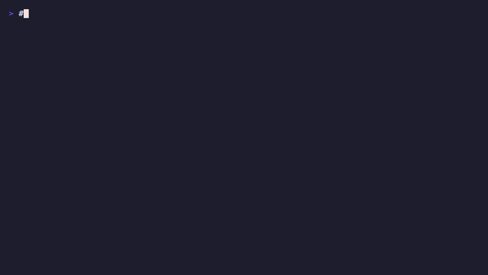
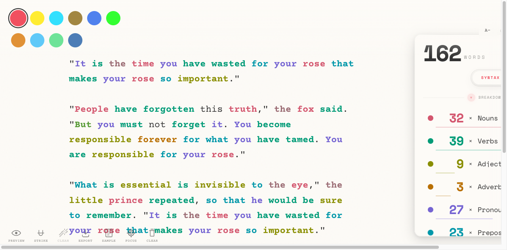
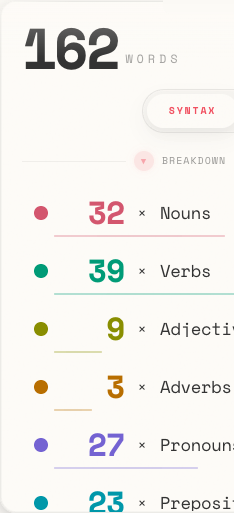
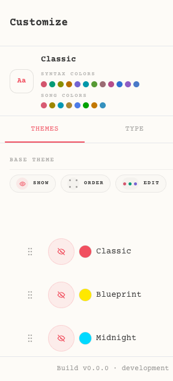

<div align="center">

# Clean Writer




### Distraction-free writing with real-time syntax highlighting


[Live App](https://clean-writer.vercel.app)

</div>

<div align="center">
  
  <br/><br/>
  
  
</div>

---

A distraction-free writing app with real-time syntax highlighting and PWA support.

## Quick Start

```bash
npm install
npm run dev
```

Open [http://localhost:3002](http://localhost:3002)

## Install on Your Phone

1. Open the app in Safari (iOS) or Chrome (Android)
2. Tap **Share** → **Add to Home Screen**
3. Done! Works offline.

## Features

| Feature | Description |
|---------|-------------|
| **Typewriter Mode** | Forward-only typing (no backspace) for focused writing |
| **Syntax Highlighting** | Nouns/verbs/adjectives + URLs, numbers, hashtags (Web Worker, O(1) lookups) |
| **Theme Presets** | Classic, Blueprint, Midnight, Paper, Sepia, Terminal, Ocean, Forest, Flexoki |
| **Markdown Preview** | Lo-fi monochrome preview with blinking cursor (eye icon toggle) |
| **Strikethrough** | Select text → click ~~S~~ button (selection stays visually frozen on mobile until action) |
| **Magic Clean** | Removes complete `~~...~~` blocks for clean writing |
| **Export** | Download as `.md` file |
| **PWA** | Install on iOS/Android home screen |
| **Offline** | Works without internet |
| **Responsive** | Mobile-friendly with side panel for syntax controls |
| **Harmonica Gesture** | Single continuous drag on mobile (40px→Peek→120px→Expand→220px→Full) |
| **UTF Support** | UTF-aware word counting + optional emoji code display (`U+...`) |
| **Quick Stats** | Clean collapsible counters for URLs, numbers, hashtags (no `(All Zero)` label noise) |
| **Build Identity** | Full build identity + wordism in settings; version-only badge next to the gear icon |
| **Markdown Headings** | H1-H4 with muted styling, separate word counting in breakdown panel |
| **Todo Checkboxes** | `- [ ]` / `- [x]` with click-to-toggle, checked items strikethrough |
| **Code Blocks** | Fenced code blocks with Shiki syntax highlighting (200+ languages) |
| **Code Mode** | Full code editor mode with monospace font, line numbers, language detection |
| **Cursor Dot** | Garfield-colored dot at typing frontier with subtle glow |
| **Song Mode** | Syllable counting, rhyme scheme detection (CMU dictionary), per-line density coloring, syllable annotations |
| **Interactive Rhymes** | Hover preview, click toggle, double-click solo for rhyme groups (same interaction model as word types) |
| **Section Headings** | Collapsible RHYMES and LINES sections in song panel with persistent state |
| **Drag Reorder Themes** | @dnd-kit sortable drag-and-drop for theme ordering (grip handle, no long-press delay) |
| **Drag-to-Delete** | Smooth drag ghost with ref-based position tracking (zero React re-renders during drag) |
| **Sample Text** | Toolbar button to load a Little Prince excerpt on demand (with confirmation dialog) |
| **Ghost Cursor** | Custom blinking cursor (530ms) color-matched to syntax; native caret hidden |
| **Collapsible Breakdown** | Toggle word type list with colored indicator |
| **Golden Ratio Spacing** | φ-based spacing (8→13→21→34→55→89px) for harmonious layouts |
| **Theme-Aware UI** | All buttons/controls adapt to light/dark themes |

## Keyboard

- **Type** → Characters append to end
- **Enter** → New line
- **Backspace** → Disabled (typewriter mode)

## Shortcuts

All shortcuts managed by `@tanstack/react-hotkeys`. Hold **Tab** to see the cheat sheet overlay.

| Key | Action |
|-----|--------|
| Mod+Shift+X | Strikethrough |
| Mod+Shift+K | Clean struck text |
| Mod+Shift+D | Delete all |
| Mod+Shift+E | Export markdown |
| Mod+Shift+P | Toggle preview |
| Mod+Shift+F | Cycle focus mode |
| 1 – 9 | Toggle word types |
| ← → ↑ ↓ | Focus navigation |
| Escape | Exit focus mode |

`Mod` = `Cmd` on macOS, `Ctrl` on Windows/Linux.

## Commands

```bash
npm run dev          # Start dev server (port 3002)
npm run build        # Production build
npm run preview      # Preview production build
npm run test         # Run Cypress specs
npm run cy:open      # Open Cypress runner
npx playwright test  # Run Playwright E2E tests
```

## Testing

**164 Cypress tests** across 22 spec files + **11 Playwright E2E tests** = **175 total**.

| Suite | Tests | Coverage |
|-------|-------|----------|
| `typewriter-input` | 12 | Core input, paste, emoji, special chars |
| `ime-composition` | 8 | CJK, Unicode, mixed scripts |
| `strikethrough` | 6 | Apply, remove, clean |
| `focus-mode` | 7 | Mode cycling, navigation |
| `keyboard-shortcuts` | 9 | Toolbar interactions, toggles |
| `markdown-extended` | 14 | Heading/todo/code edge cases |
| `markdown-features` | 12 | Headings, todos, code blocks |
| `code-mode` | 9 | Toggle, panel, mutual exclusion |
| `theme-color-editing` | 9 | Swatch switching, customizer |
| `song-mode` | 8 | Rhymes, mode switching |
| `panel-interactions` | 10 | Word counts, toggles, solo mode |
| `font-controls` | 7 | A-/0/A+, min/max, rapid clicks |
| `responsive-layout` | 9 | Desktop/mobile, resize transitions |
| `accessibility` | 9 | ARIA, focus, duplicate IDs |
| `chaos-monkey` | 11 | Destruction scenarios |
| + 7 legacy specs | 33 | Selection, panel layout, themes |
| **Playwright** | **11** | Writing, headings, todos, code |

## Build Identity

Build metadata is shown in two focused places:

- Gear area: `vX.Y.Z` only
- Settings footer: `Build vX.Y.Z · <track> · Build wordism: ...`
- `X.Y.Z` comes from `package.json` by default, or `VITE_APP_VERSION`
- `<track>` comes from `VITE_BUILD_TRACK` (falls back to Vite mode)

This makes local vs Vercel verification straightforward.

## Themes

Click colored circles (top-right) to switch. Theme visibility can be customized in settings.

## Files

```
├── App.tsx                    # Main app component + state management
├── components/
│   ├── Typewriter.tsx         # Editor with syntax/markdown/code highlighting
│   ├── MarkdownPreview.tsx    # Lo-fi markdown preview
│   ├── Toolbar/               # Extracted toolbar components
│   ├── ThemeCustomizer/       # Color editing panel
│   ├── ColorPicker/           # Quick color picker popover
│   ├── UnifiedSyntaxPanel/    # Word counts + syntax/song/code analysis
│   │   ├── PanelBody.tsx      # Breakdown rows, mode tabs
│   │   ├── HarmonicaContainer.tsx  # 3-stage accordion (mobile)
│   │   ├── CornerFoldTab.tsx       # Drag handle
│   │   └── DesktopSyntaxPanel.tsx  # Desktop variant
│   └── TouchButton.tsx        # Mobile-friendly button
├── hooks/
│   ├── useShikiHighlighter.ts # Lazy-loaded Shiki code highlighting
│   ├── useTypewriterScroll.ts # Golden ratio cursor positioning
│   ├── useIMEComposition.ts   # CJK input handling
│   ├── useDynamicPadding.ts   # Content-aware horizontal centering
│   ├── useHarmonicaDrag.ts    # 3-stage drag state machine
│   └── useAppHotkeys.ts       # Keyboard shortcut registry
├── services/
│   └── localSyntaxService.ts  # NLP word counting + markdown structure
├── utils/
│   ├── graphemeUtils.ts       # Cursor metrics + grapheme-aware measurement
│   ├── colorContrast.ts       # WCAG contrast checking
│   └── syntaxPatterns.ts      # URL/hashtag/number detection
├── types.ts                   # TypeScript interfaces
├── tests/cypress/specs/       # 22 Cypress E2E specs (164 tests)
├── e2e/                       # 11 Playwright E2E tests
├── cypress.config.ts          # Cypress config (port 3002)
└── playwright.config.ts       # Playwright config (port 3002)
```

## Tech Stack

- React 19 + TypeScript
- Vite + vite-plugin-pwa
- Tailwind CSS
- Shiki (code syntax highlighting, 200+ languages)
- Cypress + Playwright (testing)
- Compromise (NLP)

---

**[📖 Full Documentation](./DOCS.md)** | **[📋 Progress Log](./PROGRESS.md)**
