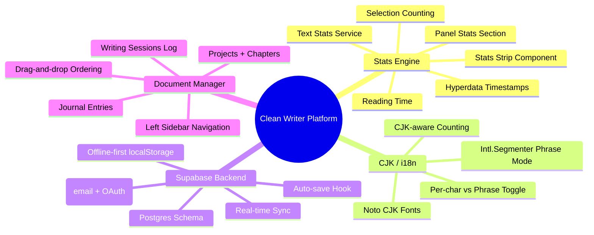

# Clean Writer Platform: Counting, CJK, Persistence & Document Management

**Date:** 2026-03-30
**Branch:** `feature/counting-cjk-platform`
**Status:** Design approved

## Context

Clean Writer is a distraction-free writing app (React + Vite + Tailwind) with syntax analysis, phoneme visualization, and focus modes. Currently it's client-only with localStorage persistence. This spec adds:

1. **Character-level counting visualization** — live text stats at sentence, paragraph, and document level
2. **CJK/multi-language support** — Traditional Chinese fonts, phrase-level word grouping
3. **Supabase persistence** — database, auth, real-time sync
4. **Document management** — projects, chapters, journals with hyperdata

The goal: transform Clean Writer from a single-document scratchpad into a full creative writing platform while preserving the existing visual design and mobile-first experience.



---

## 1. Character-Level Counting Visualization

### 1.1 Stats Strip (Always Visible)

A compact, single-line bar positioned between the textarea and the bottom toolbar.

**Display format:**
```
S: 42c 8w   ¶: 187c 31w 4s   ∑: 1,247c 203w 18s · 1m read   · edited 5s ago
```

**Three scopes, always live:**
- **S:** (Sentence) — char count + word count of the sentence at cursor position
- **¶:** (Paragraph) — chars, words, sentence count of current paragraph
- **∑:** (Total) — chars, words, sentences, reading time for entire document

**Selection behavior:** When text is selected, **S:** becomes **Sel:** showing selected text stats (chars, words, sentences if multi-sentence selection).

**Hyperdata:** Relative timestamp showing last edit time ("edited 5s ago", "2h ago", etc.), updating live.

**Configuration:** Users can toggle which scopes to show. Settings stored in `user_preferences.counting_config` (JSON) with localStorage fallback.

**Styling:** Inherits theme colors. Monospace font for counts. Muted color for labels, brighter for values. Semi-transparent background matching the toolbar style.

### 1.2 Panel Stats Section (Deep Dive)

Added to the existing `UnifiedSyntaxPanel` as a collapsible "Text Stats" section:

- **Current sentence stats** — chars, words
- **Current paragraph stats** — chars, words, sentences
- **Document stats** — chars, words, sentences, paragraphs, reading time
- **Averages** — avg sentence length (chars/words), avg paragraph length
- **Distribution** — shortest/longest sentence, shortest/longest paragraph (clickable to navigate)
- **Per-paragraph breakdown** — list of paragraphs with their stats, click to jump to paragraph

### 1.3 Stats Engine

**New file:** `services/textStatsService.ts`

```typescript
interface TextStats {
  chars: number;        // character count
  words: number;        // word count
  sentences: number;    // sentence count
  paragraphs: number;   // paragraph count
  readingTimeMs: number; // estimated reading time in milliseconds
}

interface CursorStats {
  sentence: TextStats;      // stats for sentence at cursor
  paragraph: TextStats;     // stats for paragraph at cursor
  document: TextStats;      // stats for entire document
  selection?: TextStats;    // stats for selected text (if any)
  lastEditedAt: number;     // timestamp of last edit
}
```

**Reuses existing code:**
- `textSegmentation.ts` → `getSentenceBoundaries()`, `getParagraphBoundaries()`, `getWordBoundaries()`
- `localSyntaxService.ts` → `countWords()`

**New functions:**
- `countChars(text: string): number` — character count (grapheme-cluster aware via `Intl.Segmenter`)
- `getReadingTime(wordCount: number, locale?: string): number` — 200 WPM for English, 300-500 CPM for CJK
- `getStatsAtCursor(content: string, cursorPos: number, selStart?: number, selEnd?: number): CursorStats`
- `getPerParagraphStats(content: string): TextStats[]`

**Performance:** Runs on main thread. Sentence-level stats update immediately on keystroke. Paragraph/document level debounced at 50ms. No Web Worker needed (pure math, no NLP).

---

## 2. CJK / Multi-Language Support

### 2.1 Font Loading

Add to `index.html` Google Fonts import:
- **Noto Sans TC** (Traditional Chinese) — weights 400, 700
- **Noto Sans SC** (Simplified Chinese) — weights 400, 700

Update font stacks in `constants.ts` to include CJK fallbacks:
```
font-family: [user-chosen-font], "Noto Sans TC", "Noto Sans SC", "PingFang TC", "Microsoft JhengHei", sans-serif;
```

Auto-detection: if document content contains >30% CJK characters (using existing `hasNonLatinContent()` pattern), apply CJK font stack automatically.

### 2.2 Word Counting Modes

**Per-character mode (default):** Each CJK character = 1 word. Current behavior, already implemented in `countWords()`.

**Phrase grouping mode:** Use `Intl.Segmenter("zh-Hant", { granularity: "word" })` for linguistic word boundaries. 你好 = 1 word, 世界 = 1 word.

**Toggle:** Setting in user preferences: `language_mode: "per-char" | "phrase-grouping"`. Exposed in the settings/customizer panel.

### 2.3 Char Counting for CJK

Stats strip shows actual character count (1 CJK char = 1 char). Reading time calculation uses characters-per-minute (CPM) instead of words-per-minute when CJK content detected:
- Chinese: 400 CPM (default)
- Japanese: 500 CPM (default)
- Korean: 600 CPM (default)
- English: 200 WPM (existing)

### 2.4 Syntax Analysis Limitation

The `compromise` NLP library is English-only. When CJK content is detected (>30% non-Latin):
- Syntax panel word-type breakdown shows a notice: "Word type analysis available for English text"
- Word count + char stats still fully functional
- Phoneme mode disabled for CJK text (already English-only)

---

## 3. Supabase Persistence

### 3.1 Setup

- Add `@supabase/supabase-js` dependency
- Create Supabase project (user provides credentials)
- Environment variables in `.env.local` (gitignored): `VITE_SUPABASE_URL`, `VITE_SUPABASE_ANON_KEY`
- Add `.env.example` with placeholder values for documentation

### 3.2 Database Schema

```sql
-- Users (managed by Supabase Auth)
-- Additional profile data
CREATE TABLE profiles (
  id UUID PRIMARY KEY REFERENCES auth.users(id),
  display_name TEXT,
  created_at TIMESTAMPTZ DEFAULT NOW()
);

-- Projects (top-level containers)
CREATE TABLE projects (
  id UUID PRIMARY KEY DEFAULT gen_random_uuid(),
  user_id UUID REFERENCES profiles(id) NOT NULL,
  title TEXT NOT NULL DEFAULT 'Untitled Project',
  description TEXT,
  position INTEGER DEFAULT 0,
  created_at TIMESTAMPTZ DEFAULT NOW(),
  updated_at TIMESTAMPTZ DEFAULT NOW()
);

-- Documents (chapters, standalone pieces)
CREATE TABLE documents (
  id UUID PRIMARY KEY DEFAULT gen_random_uuid(),
  project_id UUID REFERENCES projects(id) ON DELETE CASCADE,
  user_id UUID REFERENCES profiles(id) NOT NULL,
  title TEXT NOT NULL DEFAULT 'Untitled',
  content TEXT DEFAULT '',
  doc_type TEXT NOT NULL DEFAULT 'standalone' CHECK (doc_type IN ('chapter', 'standalone', 'scratchpad')),
  position INTEGER DEFAULT 0,
  word_count INTEGER DEFAULT 0,
  char_count INTEGER DEFAULT 0,
  created_at TIMESTAMPTZ DEFAULT NOW(),
  updated_at TIMESTAMPTZ DEFAULT NOW()
);

-- Journal entries (date-based)
CREATE TABLE journal_entries (
  id UUID PRIMARY KEY DEFAULT gen_random_uuid(),
  user_id UUID REFERENCES profiles(id) NOT NULL,
  entry_date DATE NOT NULL DEFAULT CURRENT_DATE,
  content TEXT DEFAULT '',
  mood TEXT,
  word_count INTEGER DEFAULT 0,
  char_count INTEGER DEFAULT 0,
  writing_duration_seconds INTEGER DEFAULT 0,
  created_at TIMESTAMPTZ DEFAULT NOW(),
  updated_at TIMESTAMPTZ DEFAULT NOW(),
  UNIQUE(user_id, entry_date)
);

-- Writing sessions (practice log)
CREATE TABLE writing_sessions (
  id UUID PRIMARY KEY DEFAULT gen_random_uuid(),
  user_id UUID REFERENCES profiles(id) NOT NULL,
  document_id UUID REFERENCES documents(id) ON DELETE SET NULL,
  journal_entry_id UUID REFERENCES journal_entries(id) ON DELETE SET NULL,
  started_at TIMESTAMPTZ NOT NULL DEFAULT NOW(),
  ended_at TIMESTAMPTZ,
  words_written INTEGER DEFAULT 0,
  chars_written INTEGER DEFAULT 0,
  session_type TEXT NOT NULL DEFAULT 'freewrite' CHECK (session_type IN ('chapter', 'journal', 'freewrite'))
);

-- User preferences (synced)
CREATE TABLE user_preferences (
  id UUID PRIMARY KEY DEFAULT gen_random_uuid(),
  user_id UUID REFERENCES profiles(id) NOT NULL UNIQUE,
  theme_id TEXT,
  font_id TEXT,
  font_size_offset INTEGER DEFAULT 0,
  counting_config JSONB DEFAULT '{"showSentence": true, "showParagraph": true, "showTotal": true}',
  language_mode TEXT DEFAULT 'per-char' CHECK (language_mode IN ('per-char', 'phrase-grouping')),
  updated_at TIMESTAMPTZ DEFAULT NOW()
);

-- Row Level Security
ALTER TABLE projects ENABLE ROW LEVEL SECURITY;
ALTER TABLE documents ENABLE ROW LEVEL SECURITY;
ALTER TABLE journal_entries ENABLE ROW LEVEL SECURITY;
ALTER TABLE writing_sessions ENABLE ROW LEVEL SECURITY;
ALTER TABLE user_preferences ENABLE ROW LEVEL SECURITY;

-- Users can only access their own data
CREATE POLICY "Users own their projects" ON projects FOR ALL USING (user_id = auth.uid());
CREATE POLICY "Users own their documents" ON documents FOR ALL USING (user_id = auth.uid());
CREATE POLICY "Users own their journal entries" ON journal_entries FOR ALL USING (user_id = auth.uid());
CREATE POLICY "Users own their sessions" ON writing_sessions FOR ALL USING (user_id = auth.uid());
CREATE POLICY "Users own their preferences" ON user_preferences FOR ALL USING (user_id = auth.uid());
```

### 3.3 Offline-First Strategy

- **localStorage remains primary cache** — the app works offline exactly as it does today
- **Supabase syncs in background** — auto-save debounced at 2 seconds after last edit
- **Conflict resolution:** last-write-wins with `updated_at` timestamp comparison
- **Migration:** On first auth, existing localStorage content becomes a document in a "My Writing" default project

### 3.4 Auth Flow

- **Anonymous by default** — app works without login, data stays in localStorage
- **Optional sign-up** — email/password or OAuth (Google). On sign-up, localStorage migrates to Supabase
- **Login prompt** — subtle, non-intrusive. Small "Sign in to sync" link in settings, not a gate

### 3.5 Client Integration

**New hook:** `hooks/useSupabase.ts`
- Manages Supabase client instance
- Handles auth state
- Provides `save()`, `load()`, `sync()` methods

**New hook:** `hooks/useAutoSave.ts`
- Debounced save (2s) on content change
- Saves to both localStorage (immediate) and Supabase (debounced)
- Tracks `lastSavedAt` for hyperdata timestamp

---

## 4. Document Management & Journals

### 4.1 Left Sidebar Navigation

**New component:** `components/DocumentSidebar/`

- **Desktop:** Collapsible left sidebar, hidden by default. Toggle with `Mod+Shift+B` or hamburger icon.
- **Mobile:** Slide-in drawer from left edge (symmetrical with right-side syntax panel).
- Does NOT change the existing right-side panel or bottom toolbar.

**Sidebar contents:**
1. **Quick actions:** New Document, New Journal Entry, New Project
2. **Projects list:** Expandable tree — Project → Documents/Chapters (ordered)
3. **Journal section:** Calendar view or date list, today's entry pinned at top
4. **Scratchpad:** Always-accessible quick note document
5. **Writing Log:** Stats overview — streak, total words, recent sessions

### 4.2 Document Switching

- Click a document in sidebar → loads into the main editor (textarea)
- Current document auto-saves before switching
- Editor state (cursor position, scroll position) preserved per document in localStorage
- Active document highlighted in sidebar

### 4.3 Journal System

- **Daily entry:** Tap "+" on today's date → creates `journal_entries` row pre-titled with date
- **Freeform notebook:** A persistent `scratchpad` type document, always one per user
- **Writing practice log:** Auto-tracked from `writing_sessions`. Shows:
  - Current streak (consecutive days with entries)
  - Total words written this week/month
  - Session history with duration and word count

### 4.4 Hyperdata Display

On every document/entry in the sidebar list:
- **Relative timestamp:** "5s ago", "2h ago", "yesterday", "Mar 28"
- **Word count badge:** compact count next to title
- **Active indicator:** green dot if currently editing
- Timestamps update live (every 10 seconds)

---

## 5. Files to Modify/Create

### New Files
| File | Purpose |
|------|---------|
| `services/textStatsService.ts` | Stats engine — char counting, reading time, cursor stats |
| `components/StatsStrip/index.tsx` | Always-visible compact stats bar |
| `components/StatsStrip/StatsStrip.css` | Strip styling |
| `components/DocumentSidebar/index.tsx` | Left sidebar navigation |
| `components/DocumentSidebar/ProjectTree.tsx` | Project/document tree |
| `components/DocumentSidebar/JournalSection.tsx` | Journal calendar + entries |
| `components/DocumentSidebar/WritingLog.tsx` | Writing practice stats |
| `hooks/useSupabase.ts` | Supabase client + auth |
| `hooks/useAutoSave.ts` | Debounced auto-save to localStorage + Supabase |
| `hooks/useDocumentManager.ts` | CRUD operations for documents/projects |
| `hooks/useWritingSession.ts` | Session tracking (start, end, word delta) |
| `hooks/useRelativeTime.ts` | Live "5s ago" timestamps |
| `supabase/migrations/001_initial_schema.sql` | Database schema |
| `lib/supabase.ts` | Supabase client singleton |

### Modified Files
| File | Changes |
|------|---------|
| `App.tsx` | Add StatsStrip, DocumentSidebar, Supabase provider, document switching |
| `index.html` | Add Noto Sans TC/SC font imports |
| `constants.ts` | CJK font stacks, counting config defaults |
| `services/localSyntaxService.ts` | Add phrase-grouping mode to `countWords()` |
| `components/UnifiedSyntaxPanel/PanelBody.tsx` | Add Text Stats section |
| `components/Toolbar/index.tsx` | Adjust layout for stats strip |
| `package.json` | Add `@supabase/supabase-js` |
| `vite.config.ts` | Supabase env vars |
| `types.ts` | New types for documents, projects, journals, stats |

---

## 6. Verification Plan

### Stats Engine
- [ ] Stats strip shows correct char/word/sentence counts at all three levels
- [ ] Selection counting works — selecting text shows selection stats
- [ ] Cursor movement updates sentence/paragraph stats in real-time
- [ ] Reading time calculation correct for English and CJK content
- [ ] Hyperdata timestamp updates live ("5s ago" → "10s ago")
- [ ] Mobile: strip is visible and readable without covering toolbar

### CJK Support
- [ ] Traditional Chinese characters render with Noto Sans TC
- [ ] Chinese IME input works without double-input bugs (already tested, verify preserved)
- [ ] Per-character counting: 你好世界 = 4 words
- [ ] Phrase grouping: 你好世界 = 2 words (你好 + 世界) when enabled
- [ ] Reading time uses CPM for CJK-dominant text
- [ ] Syntax panel shows appropriate notice for non-English text

### Supabase
- [ ] Anonymous usage works without Supabase (graceful fallback)
- [ ] Sign up flow creates profile + migrates localStorage content
- [ ] Auto-save persists to Supabase after 2s debounce
- [ ] Offline edits sync when connection restored
- [ ] Row Level Security prevents cross-user data access

### Document Management
- [ ] Create/rename/delete projects and documents
- [ ] Chapters order correctly via drag-and-drop
- [ ] Document switching preserves editor state
- [ ] Left sidebar works on mobile (slide-in drawer)
- [ ] Sidebar doesn't interfere with existing right-side syntax panel

### Journals
- [ ] Create daily journal entry with one tap
- [ ] Entries grouped by date in sidebar
- [ ] Writing session auto-tracked (start on first keystroke, end on inactivity)
- [ ] Streak counter works correctly
- [ ] Scratchpad persists across sessions
