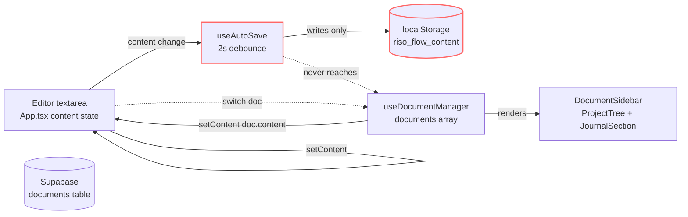

## Context

The DocumentSidebar is the project-management surface for Clean Writer. It owns the writer's mental model of "where my work lives." Today the surface looks fine but the data layer beneath it leaks: the editor and the document store are two separate sources of truth that never reconcile, and there is no creation form, no calendar, and no test coverage for the CRUD path. This change reconciles them, adds the missing surfaces, and locks the behaviour with regression tests.



The dotted "never reaches" arrow is the load-bearing bug. After this change every editor mutation walks `Editor → useAutoSave → updateDocument → documents array → Sidebar` so the badge counts update live and switching documents preserves work.

## Goals / Non-Goals

**Goals**
- Editor and `documents` array share a single source of truth: when the editor changes, the active document row changes too.
- No CRUD operation can lose user content under any interaction speed.
- Creating projects and documents uses real forms with naming and type selection, not bare buttons.
- Journal entries are browsable and creatable from a month calendar.
- Cypress regression coverage exercises rapid interaction, persistence, and navigation.

**Non-Goals**
- No schema change. Existing Supabase tables stay as-is; existing local storage keys keep their names.
- No new state-management library. We keep React local state + custom hooks.
- No multi-user collaboration. Single-user sync semantics only.
- No full rewrite of `useDocumentManager`. We surgically fix the closures and add the autosave hook integration.
- No Carbon dependency — "Carbon-style" in the user's brief is taken as visual reference only; we render with existing Tailwind tokens to avoid bundle bloat.

## Decisions

### D1 — `useAutoSave` becomes the single write path for document content

**Decision:** Extend `useAutoSave.save(content, documentId, counts)` so that when `documentId` is set, the debounced timeout calls back into a new injected updater (`updateDocument`) instead of writing only to the global `riso_flow_content` localStorage slot. Untracked content (no document yet) still writes to the global slot.

**Why:** Today there are two distinct write paths (autosave global slot vs `useDocumentManager.updateDocument`) and nothing connects them. A single path means the document row and the editor never diverge. Injecting the updater (via a constructor-style hook param or a `useEffect` ref) keeps `useAutoSave` free of `useDocumentManager` knowledge — the wiring lives in `App.tsx`.

**Alternative considered:** Move document state into `useAutoSave`. Rejected — too much surface area churned for a localized fix.

### D2 — Save-before-switch flush is synchronous-ish

**Decision:** When `onSelectDocument(newId)` runs in `App.tsx`, it first calls `updateDocument(activeDocumentId, { content, wordCount, charCount })` synchronously (the local state path is sync; the Supabase write happens fire-and-forget). Only after that does it set the new active id and load the new content.

**Why:** The local state update is synchronous so the document row reflects the latest content before we overwrite the editor. The Supabase write is best-effort and not blocking — losing a network write is recoverable; losing a state write is not.

**Risk R1:** If the user double-clicks a different doc while the previous Supabase write is in flight, two writes hit the same row in unspecified order. Acceptable because the local state path already settled the truth and Supabase will converge to whichever write lands last.

### D3 — Functional-update positions

**Decision:** `createProject` and `createDocument` compute `position` inside the setState updater:

```ts
setProjects(prev => {
  const next = [...prev, { ...project, position: prev.length }];
  saveLocal(PROJECTS_KEY, next);
  return next;
});
```

**Why:** This pattern reads the freshest array length from React's update queue, so two concurrent calls in the same frame produce `position = prev.length` and `position = prev.length + 1` deterministically.

**Risk R2:** The Supabase insert still uses a stale `position` because it runs before the setState. We accept this for now — the local view is correct, and the Supabase row's position is only the *initial* value; subsequent reorder operations (drag-and-drop, future) would overwrite it. If duplicates show up in the cloud copy, a later proposal can add a server-side max+1 trigger.

### D4 — Delete-active cleanup picks the next sensible doc

**Decision:** `onDeleteDocument(id)` in `App.tsx` checks `id === activeDocumentId`. If yes, find the deleted doc's `projectId`, then pick the first remaining doc in the same project (sorted by position), then any remaining doc, then `null`. Apply the chosen doc's content to the editor (or an empty string).

**Why:** Falling back to "the next thing they probably wanted" is a less jarring transition than "the editor is now empty for no reason." The position-sorted next doc preserves spatial intuition.

### D5 — Creation form is collapsed-by-default inline UI

**Decision:** A single `CreationForm` component renders two collapsible variants (`mode="project"` and `mode="document"`) inside the quick-actions area. Submitting calls the corresponding `useDocumentManager` create function and awaits the result; if it returns null, an inline error appears under the form.

**Why:** A modal would be heavyweight for a micro-form (1–3 fields). Inline keeps the writer's eye on the sidebar surface and matches the existing collapsible pattern used in `GuideSection` / `FeedbackSection`.

**Carbon-flavoured styling:** The user mentioned "carbon buttons" as a visual reference. We mirror the *shape* (squared corners, accent fill, subtle hover lift) using existing Tailwind utilities — no new dependency.

### D6 — CalendarSection owns its own month state

**Decision:** `CalendarSection` keeps `viewMonth` (a `Date` representing the first of the displayed month) in local state, persisted to `localStorage` under `clean_writer_calendar_view_month`. Cells are rendered from a deterministic 7×6 grid (42 cells) with day numbers from the displayed month, padded with previous/next month days for visual continuity.

**Why:** The parent doesn't need to know which month is shown. Persisting the view month is a small touch but matches the "preserve where I left off" feel of the rest of the app.

**Cell click semantics:** if the cell has an entry, fire `onSelectEntry(entry.id)`. If not, fire `onCreateEntry(date)` and then immediately select the result. Future-month cells (after today) are non-interactive — you cannot create entries dated in the future.

### D7 — Test strategy: failing-first specs land disabled

**Decision:** The Cypress spec file is added in commit 1 of cap-4 with `it.skip()` on every test. Each subsequent commit in cap-4 enables the tests for the capability it just shipped. This keeps `npm test` green throughout the apply phase while making the test work visible from the start.

**Why:** A landed-but-skipped test is documentation; an unlanded test is a TODO. Visibility matters.

**Risk R3:** A reviewer might miss that some tests are skipped. The cap-4 tasks explicitly call out enabling them as the final action in each capability.

## Risks / Trade-offs

- **R1 (Supabase race on rapid switch):** see D2. Acceptable; local state is the truth.
- **R2 (Stale Supabase positions):** see D3. Acceptable for now; reorder ops will overwrite.
- **R3 (Hidden skipped tests):** see D7. Mitigated by explicit task ordering.
- **R4 (Form bundle weight):** Inline form adds ~120 lines to the sidebar bundle. No new deps. Acceptable.
- **R5 (Calendar accessibility):** A 42-cell grid needs proper roving tabindex / arrow-key nav for full a11y. We implement basic keyboard support (Enter to activate, Tab to focus the grid, arrow keys to move) but defer screen-reader-grade announcements to a follow-up.

## Migration Plan

- No schema changes. No data migration.
- Existing `riso_flow_content` localStorage slot stays as the single-source fallback for the no-document path. When a document is active, the document row becomes the truth.
- Existing rows with `wordCount: 0` will update on the next time the user opens them and types.

## Open Questions

Tracked in `proposal.md` — OQ1 through OQ5.
